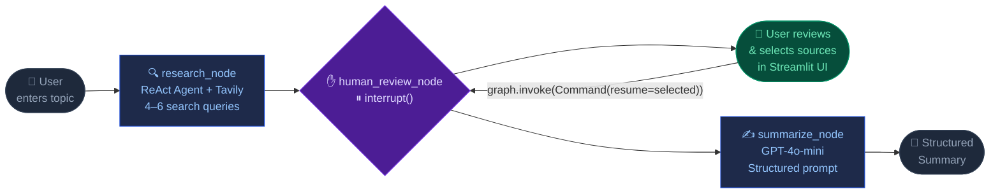

<div align="center">

<br/>

```
███╗   ██╗ ██████╗ ████████╗███████╗██████╗  ██████╗  ██████╗ ██╗  ██╗    ██╗     ███╗   ███╗    ███╗   ███╗██╗███╗   ██╗██╗
████╗  ██║██╔═══██╗╚══██╔══╝██╔════╝██╔══██╗██╔═══██╗██╔═══██╗██║ ██╔╝    ██║     ████╗ ████║    ████╗ ████║██║████╗  ██║██║
██╔██╗ ██║██║   ██║   ██║   █████╗  ██████╔╝██║   ██║██║   ██║█████╔╝     ██║     ██╔████╔██║    ██╔████╔██║██║██╔██╗ ██║██║
██║╚██╗██║██║   ██║   ██║   ██╔══╝  ██╔══██╗██║   ██║██║   ██║██╔═██╗     ██║     ██║╚██╔╝██║    ██║╚██╔╝██║██║██║╚██╗██║██║
██║ ╚████║╚██████╔╝   ██║   ███████╗██████╔╝╚██████╔╝╚██████╔╝██║  ██╗    ███████╗██║ ╚═╝ ██║    ██║ ╚═╝ ██║██║██║ ╚████║██║
╚═╝  ╚═══╝ ╚═════╝    ╚═╝   ╚══════╝╚═════╝  ╚═════╝  ╚═════╝ ╚═╝  ╚═╝    ╚══════╝╚═╝     ╚═╝    ╚═╝     ╚═╝╚═╝╚═╝  ╚═══╝╚═╝
```

### 📚 AI-Powered Research Assistant with Human-in-the-Loop

<br/>

[](https://python.org)
[](https://langchain-ai.github.io/langgraph/)
[](https://langchain.com)
[](https://platform.openai.com)
[](https://tavily.com)
[](https://streamlit.io)

<br/>

> **NotebookLM Mini** is an AI-powered research agent inspired by Google's NotebookLM.
> It autonomously searches the web across multiple angles, **pauses for your review**,
> then generates a structured summary from only the sources *you* approve.

<br/>

[🚀 Quick Start](#-quick-start) &nbsp;·&nbsp; [🏗 Architecture](#-architecture) &nbsp;·&nbsp; [✨ Features](#-features) &nbsp;·&nbsp; [📖 How HITL Works](#-how-human-in-the-loop-works) &nbsp;·&nbsp; [🛠 Tech Stack](#-tech-stack)

<br/>

</div>

---

## ✨ Features

<br/>

| &nbsp; | Feature | Description |
|:---:|---|---|
| 🤖 | **Autonomous Multi-Query Research** | Runs 4–6 diverse Tavily search queries covering different angles of your topic simultaneously |
| ✋ | **Human-in-the-Loop Control** | LangGraph `interrupt()` halts execution mid-graph so you can curate exactly which sources matter |
| 🧠 | **Structured AI Summaries** | GPT-4o-mini produces structured output: Overview → Key Points → Perspectives → Conclusions |
| 🎨 | **Modern Dark UI** | Glassmorphism design with animated gradient title, floating ambient orbs, and smooth micro-interactions |
| 🔄 | **Stateful Checkpointing** | `MemorySaver` persists the full graph state across the interrupt/resume boundary within a session |
| ⚡ | **ReAct Agent Pattern** | `create_react_agent` with a custom system prompt guides multi-angle search planning |
| 📊 | **Live Selection Stats** | Review page shows real-time count of selected / excluded sources before summarizing |
| 📋 | **Source Preview** | Expand any source card to read a 450-character content preview before deciding |

<br/>

---

## 🏗 Architecture

### LangGraph State Graph



<br/>

### State Schema

```python
class ResearchState(TypedDict):
    topic:            str           # Topic entered by the user
    sources:          List[Source]  # Raw sources collected by the ReAct agent
    approved_sources: List[Source]  # Human-curated subset passed to summarizer
    summary:          str           # Final structured summary from GPT-4o-mini
```

### Node Details

<details>
<summary><strong>🔍 research_node</strong> — click to expand</summary>

```python
def research_node(state: ResearchState) -> dict:
    llm   = ChatOpenAI(model="gpt-4o-mini", temperature=0)
    agent = create_react_agent(
        llm,
        tools=[TavilySearch(max_results=5)],
        prompt=RESEARCH_SYSTEM_PROMPT,       # instructs agent to run 4–6 diverse queries
    )
    result = agent.invoke(
        {"messages": [HumanMessage(content=f"Collect sources about: {state['topic']}")]}
    )
    return {"sources": _extract_sources(result["messages"])}
```

The ReAct agent autonomously decides *how many* searches to run and from *which angle* —
basics, recent developments, statistics, expert opinions, case studies, etc.
Sources are extracted from Tavily tool-call messages and deduplicated by URL.

</details>

<details>
<summary><strong>✋ human_review_node</strong> — click to expand</summary>

```python
def human_review_node(state: ResearchState) -> dict:
    approved = interrupt(state["sources"])   # ← execution PAUSES here
    return {"approved_sources": approved}    # ← execution RESUMES here
```

`interrupt()` raises a special LangGraph exception that:
1. Serializes the complete graph state into `MemorySaver`
2. Returns control to the calling code (Streamlit)

When the user clicks **Approve & Summarize**, Streamlit calls:
```python
graph.invoke(Command(resume=selected_sources), config=config)
```
LangGraph restores the frozen state and injects the user's selection.

</details>

<details>
<summary><strong>✍️ summarize_node</strong> — click to expand</summary>

```python
def summarize_node(state: ResearchState) -> dict:
    sources_text = "\n\n".join(
        f"Title: {s['title']}\nURL: {s['url']}\nContent: {s['content']}"
        for s in state["approved_sources"]
    )
    prompt = (
        f'Write a comprehensive summary about "{state["topic"]}" based on these sources:\n\n'
        f"{sources_text}\n\n"
        "Structure your response with:\n"
        "1. Overview\n2. Key Points\n3. Different Perspectives\n4. Conclusions"
    )
    response = llm.invoke([HumanMessage(content=prompt)])
    return {"summary": response.content}
```

</details>

<br/>

---

## 🚀 Quick Start

### Prerequisites

- Python **3.10+**
- An [OpenAI API key](https://platform.openai.com/api-keys)
- A [Tavily API key](https://tavily.com) *(free tier: 1,000 searches/month)*

### Installation

```bash
# 1. Clone the repository
git clone <repo-url>
cd "Project5 LangChain"

# 2. Install dependencies
pip install -r requirements.txt

# 3. Configure API keys
cp .env.example .env
```

Edit `.env` and fill in your keys:

```env
OPENAI_API_KEY=sk-...your-openai-key...
TAVILY_API_KEY=tvly-...your-tavily-key...
```

```bash
# 4. Launch the app
streamlit run app.py
```

Open **[http://localhost:8501](http://localhost:8501)** in your browser.

<br/>

---

## 📖 How Human-in-the-Loop Works

The key concept is LangGraph's **interrupt / resume** pattern — the graph can pause mid-execution, wait for human input, and then continue from exactly where it left off.

```
Standard agent:   node-A ──► node-B ──► node-C ──► done
                                 ↑
NotebookLM Mini:          PAUSES HERE ⏸
                          Streamlit shows sources to user
                          User selects what to keep
                          Graph resumes ▶ with approved list
```

### Step-by-step flow

```
1. User types topic  ──►  Streamlit calls graph.invoke({"topic": ...})

2. research_node runs   ──►  Agent queries Tavily 4–6 times
                              Sources collected & deduplicated

3. human_review_node    ──►  interrupt(sources) is called
                              ⏸ Graph FREEZES — state saved to MemorySaver
                              graph.invoke() returns to Streamlit

4. Streamlit renders    ──►  Review page displayed to user
   review page               User checks/unchecks source cards

5. User clicks          ──►  Streamlit calls:
   "Approve"                 graph.invoke(Command(resume=selected), config=cfg)

6. Graph RESUMES        ──►  human_review_node returns {"approved_sources": selected}

7. summarize_node runs  ──►  GPT-4o-mini generates structured summary
                              from only the approved sources

8. Done page            ──►  Summary + source cards displayed
```

> **Why `MemorySaver`?** Streamlit re-renders the entire Python script on every user interaction. Without the checkpointer persisting state, the graph would restart from scratch on every click. `MemorySaver` acts as a session-scoped database that keeps the frozen graph state alive between HTTP requests.

<br/>

---

## 🛠 Tech Stack

| Package | Version | Role |
|---|:---:|---|
| `langgraph` | 1.2.1 | Agent graph, state management, `interrupt()` HITL, `MemorySaver` |
| `langchain` | 0.3.1 | Core abstractions — messages, LLM wrappers, agent utilities |
| `langchain-openai` | 0.2.2 | GPT-4o-mini integration via `ChatOpenAI` |
| `langchain-tavily` | 0.2.18 | AI-optimised web search via `TavilySearch` |
| `streamlit` | 1.57.0 | Reactive web UI framework |
| `python-dotenv` | 1.0+ | `.env` file loading for API key management |

> **⚠️ Import note:** `langchain-tavily` 0.2.x exports `TavilySearch`, not `TavilySearchResults`.
> If you get an `ImportError`, ensure `langchain-tavily >= 0.2.0`.

<br/>

---

## 📁 Project Structure

```
Project5 LangChain/
│
├── 📄 app.py                   ← Streamlit UI
│   ├── page_input()            │  Step 1: topic entry + feature chips
│   ├── page_review()           │  Step 2: source cards, checkboxes, stats bar
│   └── page_done()             │  Step 3: tabbed summary + sources
│
├── 📁 agent/
│   ├── 📄 research_agent.py    ← LangGraph graph definition
│   │   ├── research_node       │  ReAct agent + Tavily (4–6 queries)
│   │   ├── human_review_node   │  interrupt() — HITL pause point
│   │   └── summarize_node      │  GPT-4o-mini structured summary
│   └── 📄 __init__.py
│
├── 📄 requirements.txt
├── 📄 .env.example             ← Copy to .env and fill in API keys
└── 📄 README.md
```

<br/>

---

## 💡 Example Research Topics

| Domain | Example Topic |
|---|---|
| 🔬 Science | The future of quantum computing in post-quantum cryptography |
| 🏥 Medicine | AI applications in early-stage Alzheimer's detection 2024 |
| 🌍 Climate | Latest advances in direct air carbon capture technology |
| 💻 Engineering | Rust vs Go for high-performance systems programming |
| 📈 Finance | Central bank digital currencies (CBDC) global adoption |
| 🧠 AI/ML | Mixture-of-Experts architecture in modern large language models |
| 🚀 Space | NASA Artemis program — current status and 2025 mission roadmap |
| ⚖️ Policy | EU AI Act implementation timeline and industry impact |

> **Tip:** The more specific your topic, the better the sources. Instead of *"AI in medicine"* try *"AI for early pancreatic cancer detection clinical trials 2024"*.

<br/>

---

## 🔑 API Keys Guide

<details>
<summary><strong>Get an OpenAI API key</strong></summary>

1. Go to [platform.openai.com/api-keys](https://platform.openai.com/api-keys)
2. Click **Create new secret key**
3. Copy the key (starts with `sk-`)
4. Add to `.env`: `OPENAI_API_KEY=sk-...`

> Model used: `gpt-4o-mini` — fast and cost-effective for summarization tasks.

</details>

<details>
<summary><strong>Get a Tavily API key</strong></summary>

1. Go to [tavily.com](https://tavily.com) and sign up (free)
2. Copy your API key from the dashboard (starts with `tvly-`)
3. Add to `.env`: `TAVILY_API_KEY=tvly-...`

> Free tier: **1,000 searches/month** — plenty for development and demos.

</details>

<br/>

---

<div align="center">

**Built with** ❤️ **using LangGraph · LangChain · Streamlit · Tavily · OpenAI**

<br/>

*Project 5 — LangChain & LangGraph HITL Agent*

</div>
