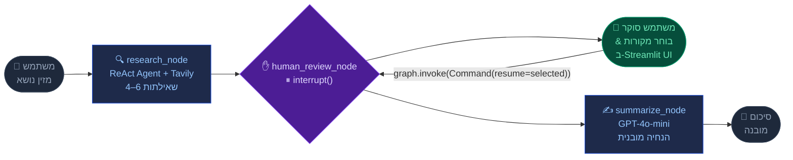

<div align="center">


<br/>


<br/>

[](https://python.org)
[](https://langchain-ai.github.io/langgraph/)
[](https://langchain.com)
[](https://platform.openai.com)
[](https://tavily.com)
[](https://streamlit.io)

<br/>

> **NotebookLM Mini** הוא עוזר מחקר חכם בהשראת Google NotebookLM.
> הוא מחפש באינטרנט ממספר זוויות, **עוצר לבדיקתך**,
> ואז מייצר סיכום מובנה רק מהמקורות שאתה מאשר.

<br/>

[🚀 התחלה מהירה](#-התחלה-מהירה) &nbsp;·&nbsp; [🏗 ארכיטקטורה](#-ארכיטקטורה) &nbsp;·&nbsp; [✨ יכולות](#-יכולות) &nbsp;·&nbsp; [📖 כיצד HITL עובד](#-כיצד-human-in-the-loop-עובד) &nbsp;·&nbsp; [🛠 טכנולוגיות](#-טכנולוגיות)

<br/>

</div>

---

## ✨ יכולות

<br/>

| &nbsp; | יכולת | תיאור |
|:---:|---|---|
| 🤖 | **מחקר אוטונומי מרובה שאילתות** | מריץ 4–6 שאילתות Tavily מגוונות המכסות זוויות שונות של הנושא בו-זמנית |
| ✋ | **פיקוח אנושי (HITL)** | `interrupt()` של LangGraph עוצר את ביצוע הגרף כך שתוכל לאצור בדיוק אילו מקורות חשובים |
| 🧠 | **סיכומי AI מובנים** | GPT-4o-mini מייצר פלט מובנה: סקירה ← נקודות מפתח ← פרספקטיבות ← מסקנות |
| 🎨 | **ממשק כהה מודרני** | עיצוב Glassmorphism עם כותרת גרדיאנט מונפשת, כדורים אמביינטיים צפים ומיקרו-אינטראקציות |
| 🔄 | **שמירת מצב (Checkpointing)** | `MemorySaver` שומר את מצב הגרף המלא לאורך גבול ה-interrupt/resume בתוך סשן |
| ⚡ | **דפוס ReAct Agent** | `create_react_agent` עם הנחיית מערכת מותאמת מנחה תכנון חיפוש רב-זוויתי |
| 📊 | **סטטיסטיקות בחירה חיות** | דף הסקירה מציג ספירה בזמן אמת של מקורות שנבחרו/הוחרגו לפני הסיכום |
| 📋 | **תצוגה מקדימה של מקורות** | הרחב כל כרטיס מקור לקריאת תצוגה מקדימה של 450 תווים לפני ההחלטה |

<br/>

---

## 🏗 ארכיטקטורה

### גרף מצב LangGraph



<br/>

### סכמת המצב

```python
class ResearchState(TypedDict):
    topic:            str           # הנושא שהוזן על ידי המשתמש
    sources:          List[Source]  # מקורות גולמיים שנאספו על ידי ה-ReAct agent
    approved_sources: List[Source]  # תת-קבוצה שנאצרה על ידי האדם ומועברת לסיכום
    summary:          str           # סיכום מובנה סופי מ-GPT-4o-mini
```

### פרטי הצמתים

<details>
<summary><strong>🔍 research_node</strong> — לחץ להרחבה</summary>

```python
def research_node(state: ResearchState) -> dict:
    llm   = ChatOpenAI(model="gpt-4o-mini", temperature=0)
    agent = create_react_agent(
        llm,
        tools=[TavilySearch(max_results=5)],
        prompt=RESEARCH_SYSTEM_PROMPT,       # מנחה את ה-agent לבצע 4–6 שאילתות מגוונות
    )
    result = agent.invoke(
        {"messages": [HumanMessage(content=f"Collect sources about: {state['topic']}")]}
    )
    return {"sources": _extract_sources(result["messages"])}
```

ה-ReAct agent מחליט באופן אוטונומי כמה חיפושים לבצע ומאיזו זווית —
בסיסים, התפתחויות אחרונות, סטטיסטיקות, דעות מומחים, מקרי מבחן וכדומה.
המקורות מחולצים מהודעות קריאת כלי Tavily ומנוקים מכפילויות לפי URL.

</details>

<details>
<summary><strong>✋ human_review_node</strong> — לחץ להרחבה</summary>

```python
def human_review_node(state: ResearchState) -> dict:
    approved = interrupt(state["sources"])   # ← הביצוע עוצר כאן
    return {"approved_sources": approved}    # ← הביצוע ממשיך כאן
```

`interrupt()` מעלה חריגה מיוחדת של LangGraph שׁ:
1. מסדרת את מצב הגרף המלא ל-`MemorySaver`
2. מחזירה שליטה לקוד הקורא (Streamlit)

כשהמשתמש לוחץ על **אשר וסכם**, Streamlit קורא:
```python
graph.invoke(Command(resume=selected_sources), config=config)
```
LangGraph משחזר את המצב הקפוא ומזריק את בחירת המשתמש.

</details>

<details>
<summary><strong>✍️ summarize_node</strong> — לחץ להרחבה</summary>

```python
def summarize_node(state: ResearchState) -> dict:
    sources_text = "\n\n".join(
        f"Title: {s['title']}\nURL: {s['url']}\nContent: {s['content']}"
        for s in state["approved_sources"]
    )
    prompt = (
        f'Write a comprehensive summary about "{state["topic"]}" based on these sources:\n\n'
        f"{sources_text}\n\n"
        "Structure your response with:\n"
        "1. Overview\n2. Key Points\n3. Different Perspectives\n4. Conclusions"
    )
    response = llm.invoke([HumanMessage(content=prompt)])
    return {"summary": response.content}
```

</details>

<br/>

---

## 🚀 התחלה מהירה

### דרישות מקדימות

- Python **3.10+**
- [מפתח API של OpenAI](https://platform.openai.com/api-keys)
- [מפתח API של Tavily](https://tavily.com) *(שכבה חינמית: 1,000 חיפושים/חודש)*

### התקנה

```bash
# 1. שכפל את המאגר
git clone <repo-url>
cd "Project5 LangChain"

# 2. התקן תלויות
pip install -r requirements.txt

# 3. הגדר מפתחות API
cp .env.example .env
```

ערוך את `.env` ומלא את המפתחות שלך:

```env
OPENAI_API_KEY=sk-...your-openai-key...
TAVILY_API_KEY=tvly-...your-tavily-key...
```

```bash
# 4. הפעל את האפליקציה
streamlit run app.py
```

פתח **[http://localhost:8501](http://localhost:8501)** בדפדפן שלך.

<br/>

---

## 📖 כיצד Human-in-the-Loop עובד

המושג המרכזי הוא דפוס ה**interrupt / resume** של LangGraph — הגרף יכול לעצור באמצע הביצוע, לחכות לקלט אנושי, ואז להמשיך בדיוק מאיפה שהפסיק.

```
Agent רגיל:      node-A ──► node-B ──► node-C ──► סיום
                                 ↑
NotebookLM Mini:          עוצר כאן ⏸
                          Streamlit מציג מקורות למשתמש
                          המשתמש בוחר מה לשמור
                          הגרף ממשיך ▶ עם הרשימה המאושרת
```

### זרימה שלב אחר שלב

```
1. המשתמש מקליד נושא  ──►  Streamlit קורא graph.invoke({"topic": ...})

2. research_node רץ    ──►  Agent שולח שאילתות ל-Tavily 4–6 פעמים
                              מקורות נאספים ומנוקים מכפילויות

3. human_review_node   ──►  interrupt(sources) נקרא
                              ⏸ הגרף קופא — מצב נשמר ב-MemorySaver
                              graph.invoke() חוזר ל-Streamlit

4. Streamlit מרנדר    ──►  דף הסקירה מוצג למשתמש
   דף הסקירה               המשתמש מסמן/מבטל כרטיסי מקור

5. המשתמש לוחץ         ──►  Streamlit קורא:
   "אשר"                    graph.invoke(Command(resume=selected), config=cfg)

6. הגרף ממשיך          ──►  human_review_node מחזיר {"approved_sources": selected}

7. summarize_node רץ   ──►  GPT-4o-mini מייצר סיכום מובנה
                              רק מהמקורות המאושרים

8. דף הסיום            ──►  סיכום + כרטיסי מקור מוצגים
```

> **למה `MemorySaver`?** Streamlit מרנדר מחדש את כל סקריפט Python בכל אינטראקציית משתמש. בלי ה-checkpointer ששומר את המצב, הגרף היה מתחיל מחדש מה-scratch בכל לחיצה. `MemorySaver` פועל כמסד נתונים בהיקף הסשן ששומר את מצב הגרף הקפוא בין בקשות HTTP.

<br/>

---

## 🛠 טכנולוגיות

| חבילה | גרסה | תפקיד |
|---|:---:|---|
| `langgraph` | 1.2.1 | גרף agent, ניהול מצב, `interrupt()` HITL, `MemorySaver` |
| `langchain` | 0.3.1 | הפשטות ליבה — הודעות, עטיפות LLM, כלי agent |
| `langchain-openai` | 0.2.2 | אינטגרציית GPT-4o-mini דרך `ChatOpenAI` |
| `langchain-tavily` | 0.2.18 | חיפוש אינטרנט מותאם AI דרך `TavilySearch` |
| `streamlit` | 1.57.0 | מסגרת ממשק משתמש אינטרנטי ריאקטיבי |
| `python-dotenv` | 1.0+ | טעינת קבצי `.env` לניהול מפתחות API |

> **⚠️ הערת ייבוא:** `langchain-tavily` 0.2.x מייצא `TavilySearch`, לא `TavilySearchResults`.
> אם מקבלים `ImportError`, ודא ש-`langchain-tavily >= 0.2.0`.

<br/>

---

## 📁 מבנה הפרויקט

```
Project5 LangChain/
│
├── 📄 app.py                   ← Streamlit UI
│   ├── page_input()            │  שלב 1: הזנת נושא + צ'יפים של תכונות
│   ├── page_review()           │  שלב 2: כרטיסי מקור, תיבות סימון, פס סטטיסטיקות
│   └── page_done()             │  שלב 3: סיכום עם טאבים + מקורות
│
├── 📁 agent/
│   ├── 📄 research_agent.py    ← הגדרת גרף LangGraph
│   │   ├── research_node       │  ReAct agent + Tavily (4–6 שאילתות)
│   │   ├── human_review_node   │  interrupt() — נקודת עצירת HITL
│   │   └── summarize_node      │  סיכום מובנה GPT-4o-mini
│   └── 📄 __init__.py
│
├── 📄 requirements.txt
├── 📄 .env.example             ← העתק ל-.env ומלא מפתחות API
└── 📄 README.md
```

<br/>

---

## 💡 דוגמאות לנושאי מחקר

| תחום | דוגמת נושא |
|---|---|
| 🔬 מדע | עתיד המחשוב הקוונטי בקריפטוגרפיה פוסט-קוונטית |
| 🏥 רפואה | יישומי AI בגילוי מוקדם של מחלת אלצהיימר 2024 |
| 🌍 אקלים | ההתקדמויות האחרונות בטכנולוגיית לכידת פחמן ישירה מהאוויר |
| 💻 הנדסה | Rust לעומת Go לתכנות מערכות בעל ביצועים גבוהים |
| 📈 פיננסים | אימוץ גלובלי של מטבעות דיגיטליים של בנקים מרכזיים (CBDC) |
| 🧠 AI/ML | ארכיטקטורת Mixture-of-Experts במודלי שפה גדולים מודרניים |
| 🚀 חלל | תוכנית NASA Artemis — מצב נוכחי ומפת דרכים למשימות 2025 |
| ⚖️ מדיניות | ציר זמן יישום חוק AI האירופי והשפעתו על התעשייה |

> **טיפ:** ככל שהנושא שלך ספציפי יותר, כך המקורות טובים יותר. במקום *"AI ברפואה"* נסה *"AI לגילוי סרטן הלבלב בשלב מוקדם — ניסויים קליניים 2024"*.

<br/>

---

## 🔑 מדריך מפתחות API

<details>
<summary><strong>קבל מפתח OpenAI API</strong></summary>

1. עבור ל-[platform.openai.com/api-keys](https://platform.openai.com/api-keys)
2. לחץ על **Create new secret key**
3. העתק את המפתח (מתחיל עם `sk-`)
4. הוסף ל-`.env`: `OPENAI_API_KEY=sk-...`

> מודל בשימוש: `gpt-4o-mini` — מהיר וחסכוני למשימות סיכום.

</details>

<details>
<summary><strong>קבל מפתח Tavily API</strong></summary>

1. עבור ל-[tavily.com](https://tavily.com) והירשם (חינם)
2. העתק את מפתח ה-API מלוח הבקרה (מתחיל עם `tvly-`)
3. הוסף ל-`.env`: `TAVILY_API_KEY=tvly-...`

> שכבה חינמית: **1,000 חיפושים/חודש** — מספיק לפיתוח ודמואים.

</details>

<br/>

---


<div align="center">

**נבנה באהבה** ❤️ **עם LangGraph · LangChain · Streamlit · Tavily · OpenAI**

*פרויקט 5 — LangChain & LangGraph HITL Agent*

</div>
